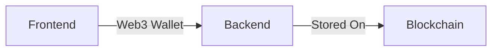
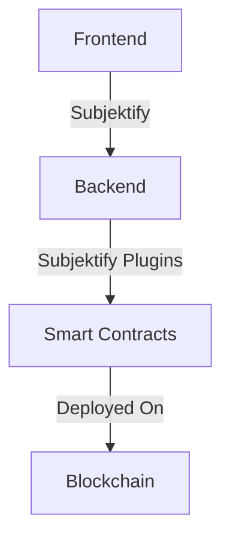
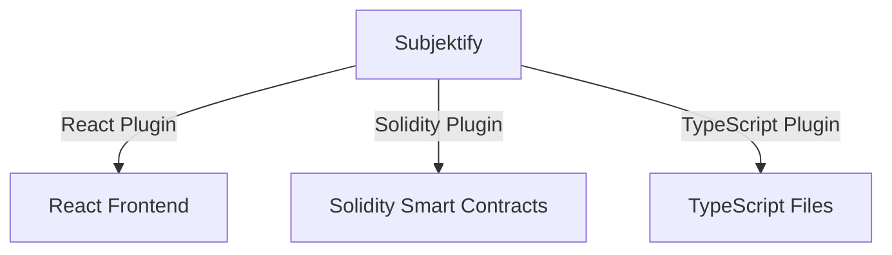

# Subjektify for New Developers

Welcome to the beginner's guide to Subjektify. If you're new to the world of decentralized applications (dApps) and blockchain, you're in the right place. This guide aims to break down complex topics into digestible pieces, helping you understand how Subjektify can make your journey into dApp development easier and more enjoyable.

## Introduction

Before diving into Subjektify, let's understand some basic terms:

- **Namespace**: A decentralized application that runs on a blockchain.
- **React**: A JavaScript library for building user interfaces.
- **Solidity**: A programming language for writing smart contracts on the Ethereum blockchain.
- **Smart Contract**: Self-executing contracts with the terms directly written into code.
- **Subject-Oriented Programming**: A programming paradigm that focuses on defining subjects that encapsulate state and behavior.

## What is a Namespace?

In the context of Subjektify, a Namespace is a self-contained unit that includes both a frontend and a backend. The frontend is the user interface that interacts with the end-users, while the backend contains the logic, often in the form of smart contracts, that is deployed on a blockchain.



## How Does Subjektify Fit In?

Subjektify serves as a comprehensive toolkit that bridges the gap between the frontend and the backend. It provides a suite of tools and plugins that streamline the entire development process, from creating smart contracts to connecting with various blockchain wallets.



### Subjektify's Plugin System

Subjektify is designed to be extensible, thanks to its robust plugin system. This allows developers to add specific functionalities tailored to their needs. Here are some examples:

- **React Plugin**: This plugin automates the process of generating client packages, making it easier to integrate your React-based frontend with blockchain functionalities.
  
- **Solidity Plugin**: This plugin is responsible for transforming your subject definitions into deployable Solidity smart contracts.
  
- **TypeScript Plugin**: After deploying your smart contracts, this plugin updates the contract addresses in your TypeScript files, ensuring that your frontend is in sync with the deployed contracts.



By leveraging Subjektify's plugin system, you can significantly speed up the development process, reduce errors, and focus more on building the unique features of your Namespace.

## Getting Started with Subjektify

### Prerequisites

- Install Node.js and npm: Download and install the latest version of Node.js, which comes with npm, from the official website.
- Install a Code Editor: Download and install a code editor of your choice. We recommend Visual Studio Code for its extensive features and plugin support.
- Install Git: Download and install Git from the official website.

### Create Your First dApp

Initialize a new dApp project:

```bash
npx subjektify create my.first.dapp
```

:::tip

You can also use [Blueprints](https://blueprints.subjektify.dev) to start your project with a specific stack:

```bash
npx subjektify create my.first.dapp -b subjektify/react.truffle
```

:::

### Understanding `subjektify.json`

This file is the configuration center for your dApp. It's automatically generated and can be customized as you become more familiar with dApp development.

## Introduction to Subjekt

Subjekt is an interface definition language that allows you to define subjects, which are the core components of your dApp's logic.

### Example: A Simple Subject

```subjekt
subject Wallet {
    version: "1.0.0"
    states: [Balance]
    behaviors: [TransferFunds]
}

state Balance {
    amount: double
}

behavior TransferFunds
```

## Wrapping Up

By now, you should have a foundational understanding of dApps, React, Solidity, and how Subjektify fits into this ecosystem. As you delve deeper, remember that Subjektify's extensive documentation and community are here to support you. Happy coding!