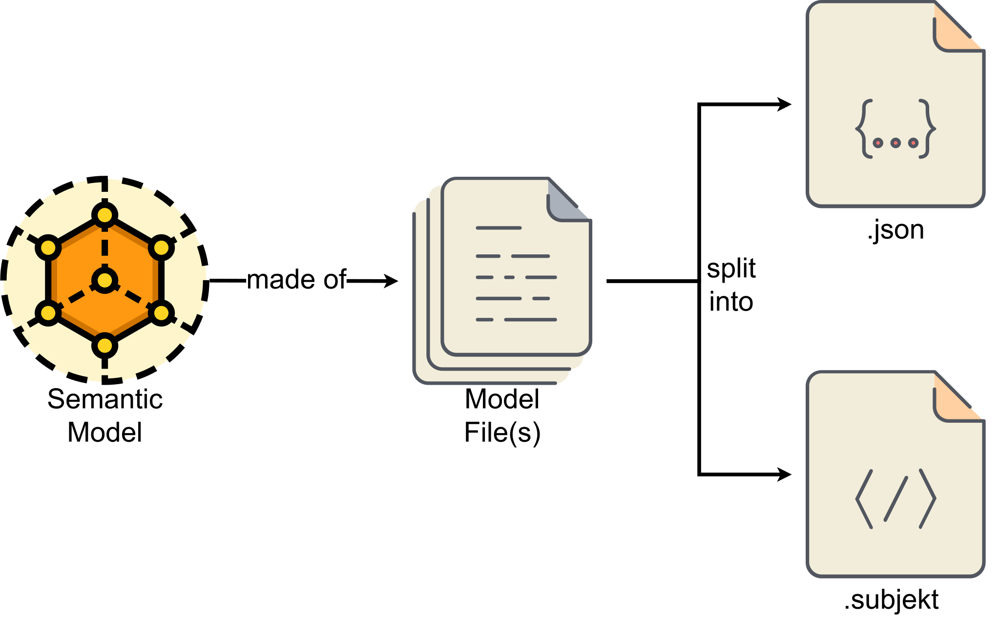

# The Subjekt Model

The Subjekt model describes the Subjekt semantic model and the files used to create it. Subjekt models are used to describe data structures, smart contracts, services, and subjects.

## Subjekt Overview

The Subjekt model can be represented in various forms, including as a semantic model, through the Interface Definition Language (IDL), and as an Abstract Syntax Tree (AST) in JSON format.

#### Semantic model

The in-memory model used by tools. The [semantic model](#semantic-model) may be serialized into one or more model file representations.

#### Model File

A file on the file system in a specific format. Model files can be divided across multiple files for better readability or modularity, and these files can use different formats (`.subjekt` or `.json`). It's the responsibility of the tooling to merge all necessary model files into a valid semantic model, as model files do not explicitly include one another.

#### Representation

A particular model file format such as the Subjekt IDL or JSON AST. Representations are loaded into the semantic model by mapping the representation to concepts in the semantic model.

- [**Subjekt IDL**](./idl): a human-readable format that aims to streamline authoring, reading, and sharing models.
- [**JSON AST**](./ast): a machine-readable JSON-based format.

## Semantic Model

The Subjekt's semantic model is an in-memory model used by tools. It is independent of any particular serialized representation. The semantic model contains metadata and a graph of shapes connected by shape IDs.
