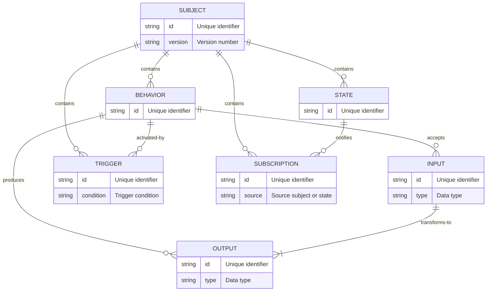

# The Subjekt Model

The Subjekt model describes the Subjekt semantic model and the files used to create it. Subjekt models are used to describe contracts, subjects and data structures.This model can be represented in various forms, including as a semantic model, through the Interface Definition Language (IDL), and as an Abstract Syntax Tree (AST) in JSON format.

## Subjekt Overview

